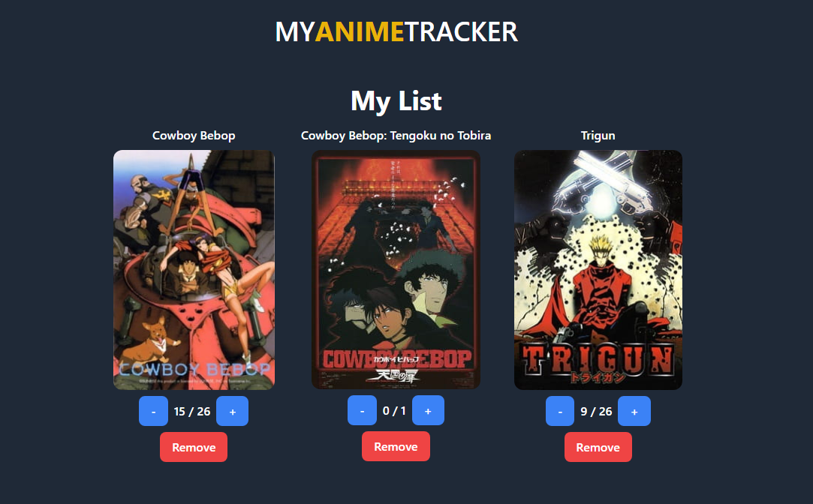

# anime-tracker 
Aplicación para buscar animes y gestionarlos en una lista de seguimiento donde puedes sumar y restar los episodios vistos.




## Instalación

1. Clona el repositorio
2. Moverse a la carpeta del repositorio
3. Usar el comando ```npm install```
4. Usar el comando ```npm run dev``` para poner en funcionamiento el bot
5. Disfrutar 🤯

## Funcionalidades

- Buscar animes
- Añadir animes a la lista de seguimiento
- Sumar capitulos
- Restar capitulos
- Eliminar animes de la lista de seguimiento
- Scroll Infinito no optimizado💀

## Jikan API
Para obtener los datos de los animes he usado la API de Jikan, puedes ver la documentación [aquí](https://docs.api.jikan.moe/)
